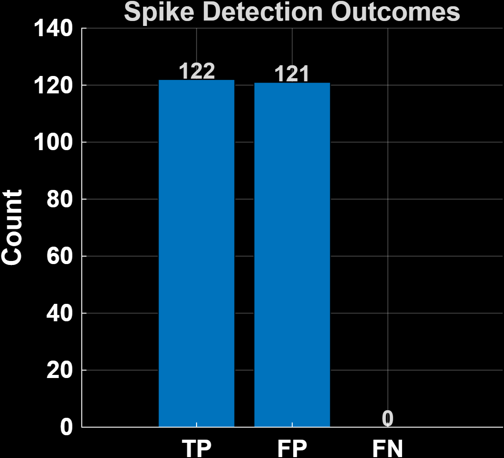
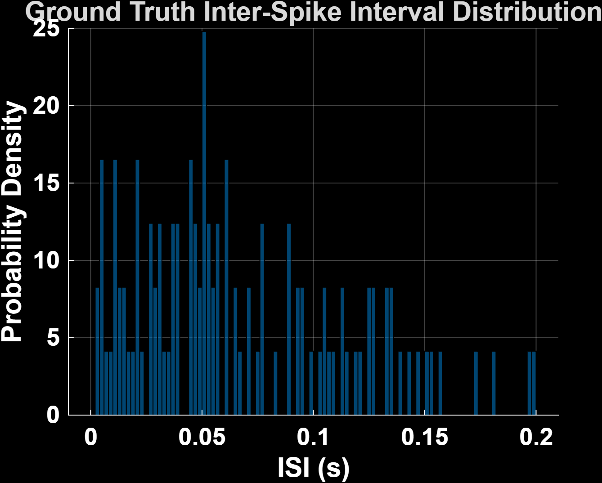
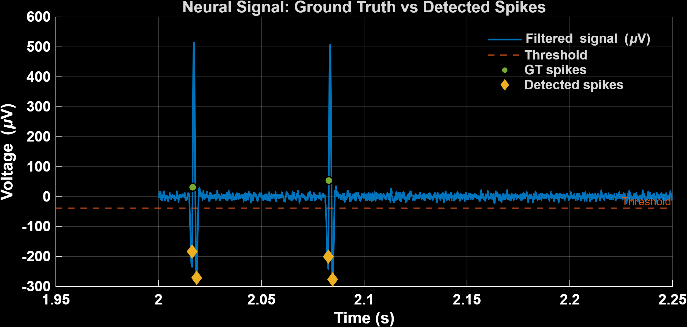

# Neural-Spike-Detector-MATLAB
MATLAB simulation and detection of extracellular neural spikes using adaptive thresholding and signal processing.

Lukha Thirion  
MATLAB  
Neuroscience • Signal Processing • Biomedical Engineering • Data Visualization

---

# Overview
This project simulates extracellular neural recordings and detects spike events using **adaptive thresholding** based on robust statistics (Median Absolute Deviation).  
The script automatically filters the signal, detects spikes, enforces a **biological refractory period**, and evaluates performance against ground-truth spike times.

Designed for **biomedical signal processing** applications — such as brain–computer interfaces (BCIs), neural prosthetics, and electrophysiology research.

---

# Features
- **Full simulation pipeline:** creates realistic extracellular neural data with noise.
- **Filtering:** bandpass or moving-average filter (toolbox-free compatible).
- **Adaptive threshold detection:** noise-scaled MAD thresholding.
- **Refractory enforcement:** prevents double detections.
- **Performance evaluation:** Precision, Recall, F1-score vs. ground truth.
- **Publication-ready plots** with clean black backgrounds for dark theme visuals.

---

# How It Works
1. **Simulate** a spike train using exponential ISI statistics.  
2. **Generate** a realistic neural waveform and inject noise (white + 1/f).  
3. **Filter** the signal (Butterworth if available, or moving-average fallback).  
4. **Detect spikes** via adaptive thresholding and refractory logic.  
5. **Compare detections** to ground truth and compute performance metrics.

---

# Example Outputs
| Spike Trace | ISI Histogram | Detection Counts |
|--------------|---------------|------------------|
|  |  |  |

---

# Usage
1. Clone or download this repository:
   ```bash
   git clone https://github.com/LukThirion/Neural-Spike-Detector.g
